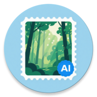

# AI Watermark

***Add AI-generated watermarks to photos to create plausible deniability of their origin!***

`Issue`, `Pull Requests`, `Star`, `Fork` are all welcomed.

Designed for:

- Create plausible deniability for exposed private content.
- Preserve attribution ambiguity in communities.
- Establish defense for unintended privacy distribution.

Enjoy :)